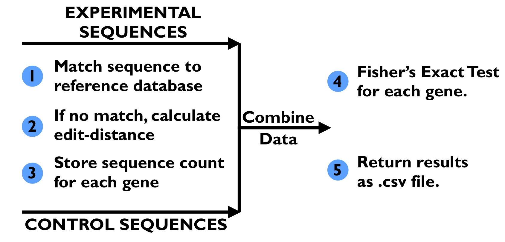

# Abstract

[CRISPR](https://en.wikipedia.org/wiki/CRISPR) screens are powerful experimental tools used to screen entire genomes in search of genes responsible for [phenotypes](https://en.wikipedia.org/wiki/Phenotype) of interest. With this approach, a single experiment can generate several gigabytes of data that, with sequential implementation, can take many hours to process, limiting the depth of sequencing and amount of analysis that can feasibly be performed. Here, we apply principles of parallel computing and algorithm design to expedite the data processing and analysis pipeline significantly. In doing so, we create a framework that provides three important features: i) Facilitation of considerably deeper sequencing experiments through parallelized expedition ii) integration of a sequence distance analysis for improved screening results iii) An associated cost-performance analysis for achieving the desired computational power within given financial constraints. 

# Introduction

## Background Information


The advent of technological advancements such as high-throughput sequencing and genome engineering, along with the increase in available computational power, has allowed biologists to adopt experimental approaches that create millions, sometimes even billions of data points per experiment. One example of such an advancement is the CRISPR genetic screen, in which researchers can introduce mutations in all twenty thousand (or so) genes in the human genome in parallel to identify new genes that are involved in a particular biological or pathological process (1).

The fundamental technology for this experimental procedure, as its name might suggest, is CRISPR genome engineering. This approach, developed from a bacterial viral defence mechanism, requires two components; a Cas9 protein, which acts like a set of molecular scissors that cuts DNA, and an RNA molecule that serves as a guide, ensuring that the Cas9 protein cuts at the specifically desired location. Using these two components, genes can be cut, copied and pasted with incredible efficiency and accuracy - and it is this efficiency that makes CRISPR genetic screens feasible.

The first step of the screen is to genetically engineer your cells of interest to express the Cas9 'scissor' protein, and to produce a large population of these cells. Next, you introduce a large library of different guide RNA molecules, which will stochastically insert themselves into your population of cells (with the help of some helpful little technique known as lentivirus transfection). The idea here is that every cell in your population has the potential for any of its genes to be removed (thanks to the presence of Cas9) - and through stochasticity, different cells will recieve guides and thus will cut out different genes. The result is a population of cells that have all the genes in their genomes mutated in parallel. 

Once this is achieved, you select the cells that display a phenotype of interest (how exactly this is done is very dependent on the particulars of the individual experiment), and sequence the DNA to identify which genes are mutated in these cells of interest.

In our particular experimental problem, we are looking at the [Shh](https://en.wikipedia.org/wiki/Sonic_hedgehog) pathway, a critical component of mammalian development. To identify cells in which this pathway is affected, the activity of this pathway is linked to the expression of a fluorescent protein, and cells with altered fluorescence are isolated with a technique known as [FACS](https://en.wikipedia.org/wiki/Flow_cytometry#Cell_sorting_by_flow_cytometry). In doing this, cells that have recieved mutations that affect this signalling pathway are identified and isolated.

## Problem Description

The output of the biological experiment for a CRISPR genetic screen consists of two files of DNA sequences:<br>
1) one file contains the DNA sequences from the control population of cells, (those that do not express the phenotype of interest) which we will call the *control file*<br>
2) the second file contains the DNA sequences from cells that were selected for some phenotype of interest, which we will call the *experimental file*.

The goal is to identify the mutations that are enriched in the experimental file compared to the control file.

Each file generally contains ten to twelve million DNA sequences that need to be processed. Each DNA sequence must be matched to a 'gold-standard' [reference database of ~80,000 sequences](https://github.com/rohuba/PACS/blob/master/data/Brie_CRISPR_library_with_control_guides.csv) to determine its origin. This matching process involves a string-to-string comparison. Generally, about 75% of the DNA sequences in a file can be perfectly matched to the gold standard. If the DNA sequence cannot be matched perfectly to this reference database, then the edit distance between the DNA sequence and each of the 80,000 gold-standard sequences must be calculated. String-to-string edit distance calculation is a very slow process, and it takes ~36s to calculate 80,000 edit distances for a single DNA sequence. Generally, around two million input sequences do not perfectly match the database of sequences, so calculating the edit distance between each of these sequences and the full reference database would take as much as 20,000 hours (36sec x 2M sequences / 3600 sec/hr). We would like to calculate the edit distances for the sequences that do not match any of the gold-standard sequences perfectly because this allows us to extract more information from a labor and time-intensive biological experiment.

Thus, this is a “Big Compute” problem because we need to compute these edit distances, and we are not sure which DNA sequences require edit distance calculation. Parallelization of this part of the application is required to make the application run in a reasonable amount of time (on the order of hours). Speed is also crucial because biological researchers depend on these results to execute their next experiments, which are time-sensitive because they are handling living cells and tissues.

MaGECK is an open-source pipeline for analyzing CRISPR screens (2) based on mean-variance modeling of the read counts for every gene. This pipeline provides read counts for genes given input control and experimental files, however it does not include a edit distance feature to determine the most likely gold-standard sequence for a sequencing read that did not perfectly match a gold-standard sequence. Additionally, MaGECK is considered a black-box program with statistics that are not well understood by general biologists. Our application would provide a missing functionality that would allow researchers to extract more information from their screens and give researchers a tool that can be clearly explained.


## Existing Pipeline

Shown above, the existing pipeline (1) takes in a *control file* and *experiment file* generated from the DNA sequencing step of the genetic screen. It also takes in a file containing the "database" of 80,000 gold-standard sequences. First, every DNA sequence in the *control file* is mapped to one of the gold-standard sequences; if the sequence matches one of the gold-standard sequences, then the match count for gold-standard sequence is incremented and the match count for corresponding gene is incremented. If no perfect match can be determined, then the edit distance between the control DNA sequence and every gold-standard sequence is calculated. The gold-standard DNA sequence with the lowest edit distance is found, and its match count and the match count for the corresponding gene are incremented. Once all the DNA sequences in the *control file* have been matched, this process is repeated for the *experimental file*. The match counts for genes in the *control file* and the *experiment file* are aggregated, and a Fisher's exact test is run on the match counts from both files to determine if there is a significant change in the number of matched sequences for each gene in the *experimental file* when compared to the *control file*. The output of the pipeline consists of, for each gene, its Fisher's exact test p-value, the number of matching sequences in the *control file*, the total number of sequences in the *control file*, the number of matching sequences in the *experimental file*, and the total number of sequences in the *experimental file*. These stats are written to a CSV file.

The code for the exisiting sequential pipeline for analyzing the results of CRISPR genetic screens can be found [here](https://github.com/rohuba/PACS/blob/master/sequential_pipeline/sequential_analysis.py). This script requires use of Python3 and relies on the use the `numpy` and `scipy` packages. Any user can install a Conda environment using the [YAML file](https://github.com/rohuba/PACS/blob/master/cs205_final_project.yml) provided to run this sequential code. The Python script `sequential_analysis.py` takes in multiple arguments through the use of command-line flags:<br>
    1. `-u` indicates the file following file path if for the *control file*<br>
    2. `-s` indicates the file following file path if for the *experimental file*<br>
    3. `-g` indicates the file following file path if for a CSV file containing the 80,000 gold-standard sequences<br>
    4. `-o` indicates the following string will be used as a prefix for the output file<br>
    
Command-line Example:<br>
`python sequential_analysis.py -u ../data/control_file_100_seqs.txt -s ../data/experimental_file_100_seqs.txt -g ../data/Brie_CRISPR_library_with_controls_guides.csv -o test_output`

The output of the script is a CSV file with six columns with the following information:
    1. Name of the gene<br>
    2. *p*-value from Fisher's exact test for enrichment<br>
    3. Number of DNA sequences from *control file* mapping to gold-standard sequences contained in this gene<br>
    4. Total number of DNA sequences in *control file*
    5. Number of DNA sequences from *experimental file* mapping to gold-standard sequences contained in this gene<br>
    6. Total number of DNA sequences in *experimental file*
    
An example of the output file for running the sequential analysis on the control file `control_file_100_seqs.txt` and the experimental file `experimental_file_100_seqs.txt` can be found [here](https://github.com/rohuba/PACS/blob/master/sequential_pipeline/test_output_gene_enrichment_calculation.csv).
    
# Project Design

## Sequential Code Profiling

The sequential code `sequential_analysis.py` was profiled using the `cProfile` Python package. The file was run with a control file of 100 sequences (*control_file_100_seqs.txt*) and an experimental file of 100 sequences (*experimental_file_100_seqs.txt*). Each of these input files contained 75 sequencing reads that could be perfectly matched to the database of 80,000 guide sequences and 25 sequencing reads that needed an edit distance calculation. This breakdown was representative of the proportion of sequencing reads in the full input files; ~25% of sequencing reads cannot be perfectly matched to one of the 80,000 guide sequences. The exact command that was run was: `python -m cProfile -o 100_seq_stats.profile sequential_analysis.py -g ../data/Brie_CRISPR_library_with_controls_FOR_ANALYSIS.csv -u ../data/Genome-Pos-3T3-Unsorted_100_seqs.txt -s ../data/Genome-Pos-3T3-Bot10_100_seqs.txt -o cProfile_test_output`. This code was run on a Macbook Pro, with a 2.2 GHz Intel Core i7 processor with 6 cores. The profiling information was saved in a file called *100_seq_stats.profile*. The following results are from the `pstats` package.
```python
import pstats

p = pstats.Stats('100_seq_stats.profile'); #read in profiling stats
p.strip_dirs(); #remove the extraneous path from all the module names

#sort according to time spent within each function, and then print the statistics for the top 20 functions. 
p.sort_stats('time').print_stats(20)

```
	Mon Apr 29 16:08:45 2019    100_seq_stats.profile
	         
	         350132307 function calls (350126604 primitive calls) in 537.388 seconds

	   Ordered by: internal time
	   List reduced from 1999 to 20 due to restriction <20>

	   ncalls  tottime  percall  cumtime  percall filename:lineno(function)
	  3981650  462.315    0.000  534.561    0.000 count_spacers_with_ED.py:35(editDistDP)
	333437825   69.985    0.000   69.985    0.000 {built-in method builtins.min}
	  3982102    1.819    0.000    1.819    0.000 {built-in method numpy.zeros}
	        2    1.414    0.707  535.981  267.990 count_spacers_with_ED.py:69(count_spacers)
	7992171/7992125    0.447    0.000    0.447    0.000 {built-in method builtins.len}
	        1    0.215    0.215    0.232    0.232 count_spacers_with_ED.py:7(createDictionaries)
	    81/79    0.153    0.002    0.156    0.002 {built-in method _imp.create_dynamic}
	    20674    0.115    0.000    0.365    0.000 stats.py:3055(fisher_exact)
	      348    0.100    0.000    0.100    0.000 {method 'read' of '_io.FileIO' objects}
	    41950    0.092    0.000    0.092    0.000 {method 'reduce' of 'numpy.ufunc' objects}
	        1    0.075    0.075    0.075    0.075 {method 'dot' of 'numpy.ndarray' objects}
	      348    0.056    0.000    0.155    0.000 <frozen importlib._bootstrap_external>:830(get_data)
	    28062    0.052    0.000    0.052    0.000 {built-in method numpy.array}
	     1604    0.035    0.000    0.035    0.000 {built-in method posix.stat}
	      348    0.034    0.000    0.034    0.000 {built-in method marshal.loads}
	    593/1    0.033    0.000  537.389  537.389 {built-in method builtins.exec}
	        1    0.033    0.033    0.405    0.405 count_spacers_with_ED.py:135(calcGeneEnrich)
	    81/65    0.024    0.000    0.077    0.001 {built-in method _imp.exec_dynamic}
	    21078    0.021    0.000    0.071    0.000 fromnumeric.py:69(_wrapreduction)
	    20675    0.020    0.000    0.020    0.000 {method 'writerow' of '_csv.writer' objects}

The majority of runtime is spent with `editDistDP` function. 534 of the 537 seconds, which accounts for 99.4% of the runtime, are spent calculating the edit distance between 50 sequencing reads and 80,000 guides. Generally, the input files contain ~10M sequencing reads, and about 25% of the sequences cannot be matched perfectly to one of the 80,000 guides. Thus for two input files of ~10M sequencing reads (~20M reads total), there are ~4-5M sequencing reads for which the edit distance calculations must be performed. If this code was run sequentially, this would require 10,000 hours of runtime. Therefore, we need to parallelize this portion of the code.

The edit distance calculation is currently nested within the function `count_spacers`, which matches each sequencing read from the input files to one of the 80,000 guides. For 200 sequencing reads provided as input, 1.4 seconds are spent performing the matching. This is only 0.007 seconds per sequencing read (using the 1.4 seconds from the *tottime* column since the *cumtime* takes into account the edit distance calculation). This number grows large if we have 20M sequencing reads - it would take . Thus, the entire matching process of our workflow needs to be parallelized.

We want to parallelize this matching process by using an AWS EMR Spark cluster to have access to as many cores as possible to perform both the matching process and edit distance calculation (if needed). We will partition each input file into many tasks, and each task will run on a single core of the Spark cluster. A single core will perform both the matching process and edit distance calculation for the sequencing reads in a partition. From what we have determined, there is not an easy way to parallelize the edit distance calculation algorithm itself, so we do not see a need for other parallelization tools such as OpenMP or MPI. Spark will be the main tool we use to parallelize this application.


## Scaling

The sequence matching and edit distance portion of our code accounts for 99.4% of the runtime in our small example. With larger problem sizes, this percentage should only increase because the number of operations performed after the sequence matching and edit distance section is constant.

Amdahl's Law states that potential program speedup  is defined by the fraction of code *c* that can be parallelized, according to the formula<br>
&plus;\frac{c}{p}})<br>
where *p* is the number of processors/cores. In our case, *c=0.994* and the table below shows the speed-ups for 2, 4, 8, 64, and 128 processors/cores:

|processors|speed-up|
|----------|--------|
|2|1.98x|
|4|3.93x|
|8|7.68x|
|64|46.44x|
|128|72.64x|

Thus, our strong-scaling is almost linear when *p* is small, but we observe that this begins to break down because we only get 73x speed-up if we were to use 128 processors/cores.

Gustafson's Law states larger systems should be used to solve larger problems because there should ideally be a fixed amount of parallel work per processor. The speed-up  is calculated by<br>
<br>
where *p* is the number of processors/cores. In our case, *c=0.994* and the table below shows the speed-ups for 2, 4, 8, 64, and 128 processors/cores:

|processors|speed-up|
|----------|--------|
|2|1.994x|
|4|3.98x|
|8|7.96x|
|64|63.62x|
|128|127.23x|

Thus, we almost achieve perfect weak-scaling because we can split up larger problem-sizes (which would be larger input files in our case) over more processors to achieve about the same runtime.

## Edit Distance Algorithm

To calculate edit distance we applied an dynamic programming algorithm known as the [Wagner-Fischer algorithm](https://en.wikipedia.org/wiki/Wagner%E2%80%93Fischer_algorithm). In recognition of the fact that the vast majority of reference sequences would bare little resemblence to any particular test sequence, we implemented a speed-up heuristic that aborted the edit distance calculation for any two sequences once the edit distance grew any larger than 3. Implementing this heuristic provided a speed-up of just over 3x. The reasoning for a cut-off of 3 for edit distances is that for a sequence of 20 base-pairs, more than three differences is indicative of the sequences being poorly matched.

## Infrastructure

We tested our parallelized code using m4.xlarge, m4.10xlarge, and m4.16xlarge instances.

#### m4.xlarge instance

The m4.xlarge instances have 4 vCPUs, 16GiB memory, and 32 GiB of EBS storage. The following information contain the architecture of the instance, the number of vCPUs, threads per core, the processor, and the cache sizes:<br>
	`Architecture:          x86_64`<br>
	`CPU(s):                4`<br>
	`On-line CPU(s) list:   0-3`<br>
	`Thread(s) per core:    2`<br>
	`Core(s) per socket:    2`<br>
	`Socket(s):             1`<br>
	`Model name:            Intel(R) Xeon(R) CPU E5-2686 v4 @ 2.30GHz`<br>
	`L1d cache:             32K`<br>
	`L1i cache:             32K`<br>
	`L2 cache:              256K`<br>
	`L3 cache:              46080K`<br>

Additionally, m4.xlarge instances have a dedicated EBS bandwidth of 750Mbps with High network performance using the EC2 Enhanced Networking (see [link](https://aws.amazon.com/ec2/instance-types/)).

From this information, we know that we only really have 2 cores per instance available to use, so this is the number of executor cores we will specify when using the Spark cluster.

#### m4.10xlarge instance
The m4.10xlarge instances have 40 vCPUs, 160GiB memory, and 32 GiB of EBS storage. The following information contain the architecture of the instance, the number of vCPUs, threads per core, the processor, and the cache sizes:<br>
	`Architecture:          x86_64`<br>
	`CPU(s):                40`<br>
	`On-line CPU(s) list:   0-39`<br>
	`Thread(s) per core:    2`<br>
	`Core(s) per socket:    10`<br>
	`Socket(s):             2`<br>
	`Model name:            Intel(R) Xeon(R) CPU E5-2676 v3 @ 2.40GHz`<br>
	`L1d cache:             32K`<br>
	`L1i cache:             32K`<br>
	`L2 cache:              256K`<br>
	`L3 cache:              30720K`<br>
Additionally, m4.10xlarge instances have a dedicated EBS bandwidth of 4,000 Mbps with 10 Gigabit Network Performance.

From this information, we know that we only really have 20 cores per instance available to use, so this is the number of executor cores we will specify when using the Spark cluster.

#### m4.16xlarge instance
The m4.16xlarge instances have 64 vCPUs, 256GiB memory, and 32 GiB of EBS storage. The following information contain the architecture of the instance, the number of vCPUs, threads per core, the processor, and the cache sizes:<br>
	`Architecture:          x86_64`<br>
	`CPU(s):                64`<br>
	`On-line CPU(s) list:   0-63`<br>
	`Thread(s) per core:    2`<br>
	`Core(s) per socket:    16`<br>
	`Socket(s):             2`<br>
	`Model name:            Intel(R) Xeon(R) CPU E5-2686 v4 @ 2.30GHz`<br>
	`L1d cache:             32K`<br>
	`L1i cache:             32K`<br>
	`L2 cache:              256K`<br>
	`L3 cache:              46080K`<br>
Additionally, m4.16xlarge instances have a dedicated EBS bandwidth of 10,000 Mbps with 25 Gigabit Network Performance.

From this information, we know that we only really have 32 cores per instance available to use, so this is the number of executor cores we will specify when using the Spark cluster.

# Usage 

TO DO

* * *

# Results

#### Testing Sequential Code on Single m4.xlarge Instance

Running with *control_file_100_seqs.txt* and *experimental_file_100_seqs.txt* input files took 12 minutes and 54 seconds to run sequentially. Both of these input file were constructed with 75 perfect matching reads and 25 that required ED calculation. About 12 of the ED sequencing reads come in the first 50 lines of each input file to split them up evenly. Output matches the output from running code on personal machines.

#### Testing Spark Code in Local Mode on Single m4.xlarge Instance

The code for this is available [here](https://github.com/rohuba/PACS/blob/master/spark_code/spark_implementation_local.py).

This was run on the testing input files *control_file_100_seqs.txt* and *experimental_file_100_seqs.txt*. 2, 3 and 4 cores were tried, however only two cores per core are given, meaning that no results could be acquired for 3 or 4 cores. We modified the `spark_implementation_local.py` code by including a `[c]` (where $c=2,3,4$) in the code at `SparkConf().setMaster('local[c]')`. 

The following command was used to run tests:<br>
`spark-submit spark_implementation_local.py -u control_file_100_seqs.txt -s experimental_file_100_seqs.txt -g Brie_CRISPR_library_with_control_guides.csv -o spark_run_1_core`.

The table below lists the number of cores used in local mode, the elapsed time, and the speed-up.

|Number of cores| Elapsed time |Speed-up|
|---------------|--------------|--------|
|1 |  685 sec | -|
|2 |  352 sec |1.94x|

#### Testing Spark Code on Cluster of m4.xlarge Instances

The code for this is available [here](https://github.com/rohuba/PACS/blob/master/spark_code/spark_implementation_distributed.py).

To tune the task/partition value for breaking up input files, the Spark application was changed to be able to take in a user-defined variable for the number of partitions the input files should be split into through command-line; the flag `-n` allows the user to define the number of partitions. Within this code, partition number for Spark was changed by adding an argument in `sc.textFile("control_file_100_seqs.txt", n)` where `n` is the number of partitions specified by the user through the `-n` flag.

The table below shows efforts to tune different parameters and improve the speed-up when using up to 8 nodes. The speed-up is compared to the performance of 1 core on 1 node of a m4.xlarge instances. 

The following command was used:<br>
`spark-submit --num-executors 2 --executor-cores 2 spark_implementation_distributed.py -u control_file_100_seqs.txt -s experimental_file_100_seqs.txt -g Brie_CRISPR_library_with_control_guides.csv -o spark_run_4_core -n 4`

|Number of worker nodes| Number of cores|Number of tasks| Elapsed time |Speed-up|
|---------------|--------------|--------------|--------|--------------|
|2 | 2 | 4 |  439 sec | 1.56x|
|2 | 2 | 32 |  249 sec | 2.75x|
|2 | 2 | 50 |  243 sec | 2.82x|
|4 | 2 | 32 |   144 sec | 4.76x|
|4 | 2 | 50 |   148 sec | 4.63x|
|8 | 2 | 32 |   139 sec | 4.93x|
|8 | 2 | 50 |  81 sec |8.46x|
|8 | 2 | 75 |   106 sec |6.46x|

From this table, we  see that more cores and more tasks give better performance. Interestingly, with 8 nodes and using 2 cores on each node, for a total of 16 threads, the performance is about equivalent to using 4 instances with 2 cores each. This is most likely because the 32 tasks on the 8 nodes causes load-balancing issues where one or two nodes get slowed down by too many edit distance calculations. Once we increase the number of tasks/partitions to 50, we see that we get ~8.5x speed-up. For these input files of 100 sequencing reads each, 75 tasks/partitions introduces more synchronization and communication overhead for Spark resulting in lower performance than the run with 50 tasks.


The real speed-up achieved is lower than the theoretical speed-up calculated using Amdahl's Law for a fixed problem size. As we increase the number of processors, the real speed-up does not follow the close-to-linear trend that was theoretically calculated. This is likely due to increased overhead due to data management and movement caused by using more cores and smaller partitions.

Since we do not know which sequences from our input files we will need to perform edit distance calculations for, it is probably best to separate the input file into as many partitions as possible because this will spread out the sequences that require edit distance calculations over as many cores as possible. As seen above, there is a performance-overhead trade-off when using more and more partitions. Using a few instances with many cores may prove to be better than using many instances that each have a couple of cores.

Next, we scaled up the problem size and instance size.

### Testing with 1000seq Input Files

We scaled up the input files ten-fold by making each input file 1000 sequence reads; each file contains 750 sequence reads that perfectly match one of the 80,000 guides and 250 sequence reads that require edit distance calculation. These files are called *control_file_1000_seqs.txt* and *experimental_file_1000_seqs.txt*. Even using two 1000 sequence read files is only $0.01$% of our full dataset.

If we were to run these input files on a single m4.xlarge instance using 1 core, we calculate that this would take
$$
\left(\dfrac{685\text{sec}}{200\text{ sequences}}\right) \cdot 2000\text{ sequences} = 6,850 \text{sec} = 1.90\text{hrs}
$$

Below is a table of the performance of multiple *m4.xlarge* instances on these 1000 sequence input files. The speed-up is calculated against our calculation of how long it would take to process this data on one core of a *m4.xlarge* instance.

|Number of worker nodes| Number of cores|Number of tasks| Elapsed time |Speed-up|
|---------------|--------------|--------------|--------|--------------|
|8 | 2 | 50 |  699 sec | 9.79x|
|8 | 2 | 100 |   634 sec |10.8x|
|8 | 2 | 500 |    600 sec |11.4x|

#### Testing with m4.10xlarge Instances in Cluster

The following command was run:<br>
`spark-submit --num-executors 4 --executor-cores 20 spark_implementation_distributed.py -u control_file_1000_seqs.txt -s experimental_file_1000_seqs.txt -g Brie_CRISPR_library_with_control_guides.csv -o spark_run_4_core -n 250`.

The speed-up is calculated against our calculation of how long it would take to process this data on one core of a m4.xlarge instance.

|Number of worker nodes| Number of cores|Number of tasks| Elapsed time |Speed-up|
|---------------|--------------|--------------|--------|--------------|
|2 | 20 | 500 |   277 sec | 24.7x|
|4 | 20 | 250 |  191 sec | 35.9x|
|4 | 40 | 250 |   185 sec | 37x|
|4 | 20 | 500 |   160 sec | 42.8x|
|4 | 20 | 750 |    159 sec | 43.1x|

Even though the *m4.10xlarge* instances offer 40 vCPUs, the speed-up by specifying 20 cores versus 40 cores when using 250 tasks is not very different, indicating that the user is really only getting 20 threads.

#### Testing with m4.16xlarge Instances in Cluster

The following command was run:<br>
`spark-submit --num-executors 4 --executor-cores 32 spark_implementation_distributed.py -u control_file_1000_seqs.txt -s experimental_file_1000_seqs.txt -g Brie_CRISPR_library_with_control_guides.csv -o spark_run_4_core -n 250`.

The speed-up is calculated against our calculation of how long it would take to process this data on one core of a m4.xlarge instance.

|Number of worker nodes| Number of cores|Number of tasks| Elapsed time |Speed-up|
|---------------|--------------|--------------|--------|--------------|
|2 | 32 | 500 |  195 sec | x|
|4 | 32 | 250 |  156 sec | 43.9x|
|4 | 64 | 250 |   150 sec | 45.7x|
|4 | 32 | 500 |   129 sec | 53.1x|
|4 | 32 | 500 |   123 sec | 55.7x|


* * * 

## Overheads 

Since we do not know for which sequences we will need to perform edit distance calculations, load-balancing is the main overhead we anticipate dealing with because we do not want one or two cores slowed down with having to compute too many edit distance calculations. We would like to spread the number of edit distance calculations out evenly between cores by tuning the number of Spark tasks. It may be good to shuffle the order of the sequencing reads because sometimes many sequences that require edit distance calculations are adjacent to each other in the input file.


# Cost-Performance Analysis

We extrapolate the improvements in runtime based on improvements made with fewer instances and cores. AWS wouldn't allow us to provision enough instances that would allow us to test these extrapolations. However we only extrapolated performance tested on 2-4 instances to up to 15 instances, and so although clusters of a larger size would have more overhead (and hence lower performance than we anticipate), we felt comfortable using these assumptions. 

We found that each of our instances had different optimal use models that relied on the number of instances provisioned. Because runtime and cost have non-linear relationships with number of instances (runtime is roughly inversely proportional to the number of instances provisioned), depending on the performance profile desired (i.e. runtime in a matter of days or weeks), different instances might be recommended to the user.

In particular - we found that using an EMR cluster consisting of larger instances (either `m4.10xlarge` or `m4.16xlarge`) was more efficient that using a cluster of smaller instances (`m4.xlarge`). Intuitively this makes sense since the overhead associated with multiple cores within an instance will be lower than the overhead associated with multiple cores amongst different instances. We found that for a user seeking to save money, running our program on a few `m4.16xlarge` instances made sense (although the code would take close to a month to run), but if speed was of the essence, using a large cluster of `m4.10xlarge` instances would prove to be more efficient. This is perhaps because of the fact that for this instance (with 20 cores), a balance is being struck between the communication overheads within and amongst the cores on different instances.

Overall we believe that this cost vs. performance profile will prove to be useful to potential users, helping them determine which infrastructure model to use based on their needs and budget.


* * *

# Discussion

TO DO

# Future Work

1. Allow user to specify where input files are in an S3 bucket. Currently, this would require more configuration in the Spark application to take in a user's private key in addition to the path to the input files, thus we did not implement this now.
2. Test the use of GPUs for calculating edit distance 80,000 times for a sequence. Due to the difficulty of configuring a Spark cluster to run with GPU instances (installation of CUDA and OpenACC on each worker node), we did not try to implement this. This would require extra overhead as well because of memory movement to/from GPU; NVIDIA Tesla K80 has about 5000 cores, so we would have to perform at least 16 read and write operations to/from GPU memory to calculate the edit distances for a single sequence.
3. Analyze control and experimental files on separate clusters and possibly use some message passing.

# References

1. Pusapati GV, Kong JH, Patel BB, Krishnan A, Sagner A,
Kinnebrew M, Briscoe J, Aravind L, Rohatgi R: CRISPR screens
uncover genes that regulate target cell sensitivity to the
morphogen sonic hedgehog. Dev Cell 2018, 44:113-129 e118.<br>
2. Li, W., Xu, H., Xiao, T., Cong, L., Love, M.I., Zhang, F., Irizarry, R.A., Liu, J.S., Brown, M., and Liu, X.S. (2014). MAGeCK enables robust identification of essential genes from genome-scale CRISPR/Cas9 knockout screens. Genome Biol. 15, 554.<br>